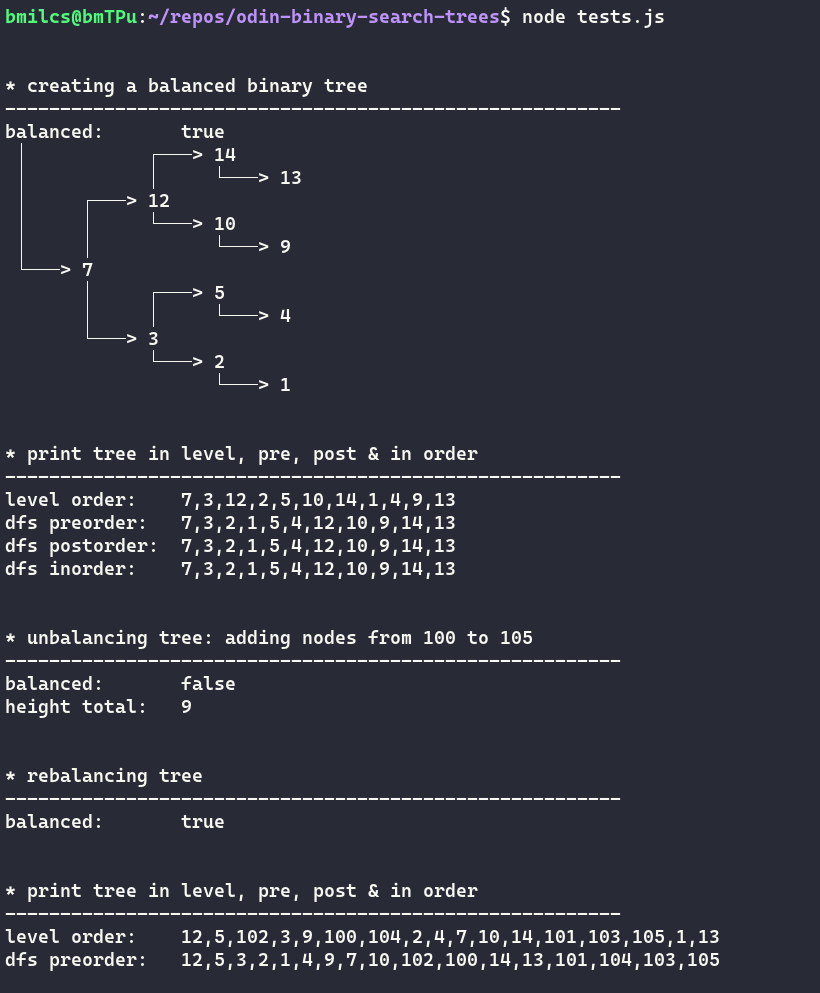
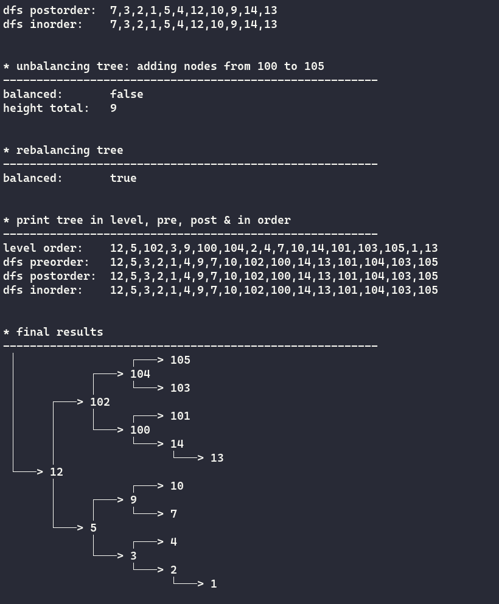

# Odin Project #15: Binary Search Trees

Welcome to Bryan Miller's Recursion Project, the [fifteenth assignment](https://www.theodinproject.com/lessons/javascript-binary-search-trees) within the Odin Project curriculum. The goal of this repo is to practice the following skill sets:

- Vanilla JavaScript
  - Recursion & Iteration
- Computer Science Data Structures
  - Balanced Binary Search Treestests

## Summary

A Binary Search Tree is a data structure that organizes data in a tree-like way. All Binary Search Trees are comprised of a simpler data structure called nodes and each node contains 3 properties:

- `data` stores a value
- `left` points to a node who's value is less than `data`
- `right` points to a node who's value is greater than its `data`

Binary Search Trees begin with a single `root` node and all values added to the tree after the root node are inserted below it. If a new value is less than the root node, it is inserted in the `left` property of the root node. If a value is greater than the root node, it's inserted in the root node's `right` property. Nodes that do not contain a `left` or `right` values are called `leaf` nodes.

This assignment called for a _Balanced_ Binary Search Tree, which is created from a deduplicated & sorted array of values. The middle value of the array becomes the `root` node, leaving an equal number of elements for the left and right sides. By doing this, the resulting Binary Tree will have a maximum depth difference of 1 between all leaf nodes.

There are two primary means of traversing a BST:

**Breadth-first** (Level-first)

- Visits all nodes on each "level" of the tree before moving on
- Utilizes a `queue`: first in, first out (FIFO)
- Time Complexity: `O(n)`
- Space Complexity: `O(n)`

**Depth-first**:

- Visits all nodes on a single side of the tree (left or right) before moving on
  - Traverse as _deep_ as possible in one direction
  - Then go across/leterally
- Utilizes a `stack`: last in, first out
  - Add to the top of the stack
  - Remove from the top of the stack
- Broken down into 3 types:
  - Preorder: Root, Left, Right
  - Inorder: Left, Root, Right
  - Postorder: Left, Right, Root
- Time Complexity: `O(n)`
- Space Complexity: `O(n)`

## Screenshots





## Links

- [My Odin Project Progress](https://github.com/bmilcs/odin-project)

## Deployment

```sh
# clone repo
git clone https://github.com/bmilcs/odin-binary-search-trees

# run script (*requires node)
node tests.js
```
